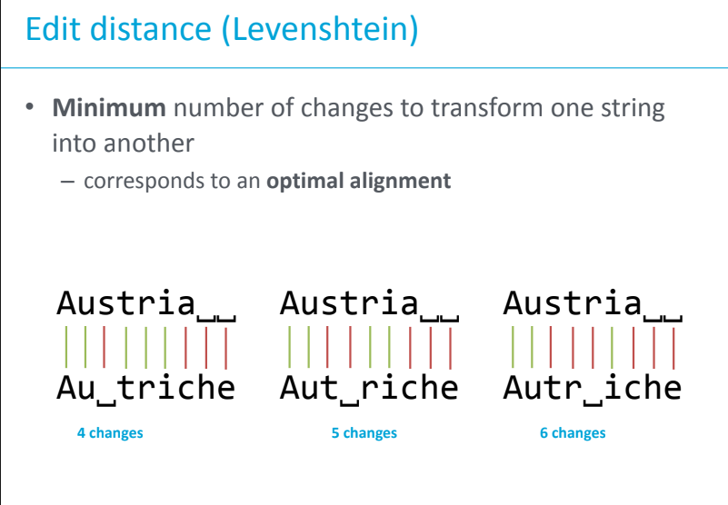
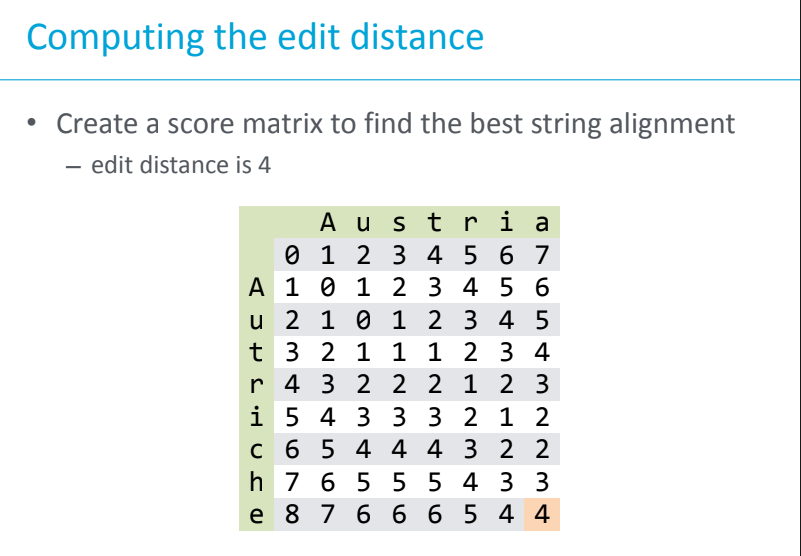
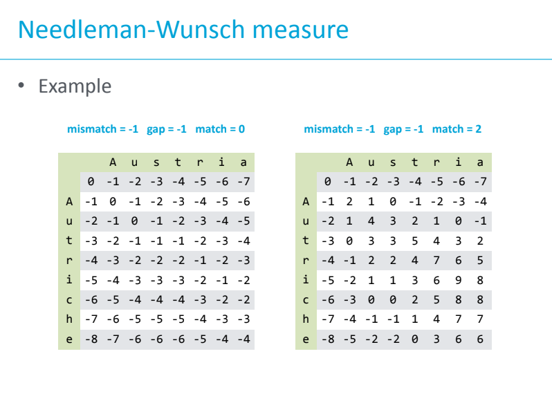
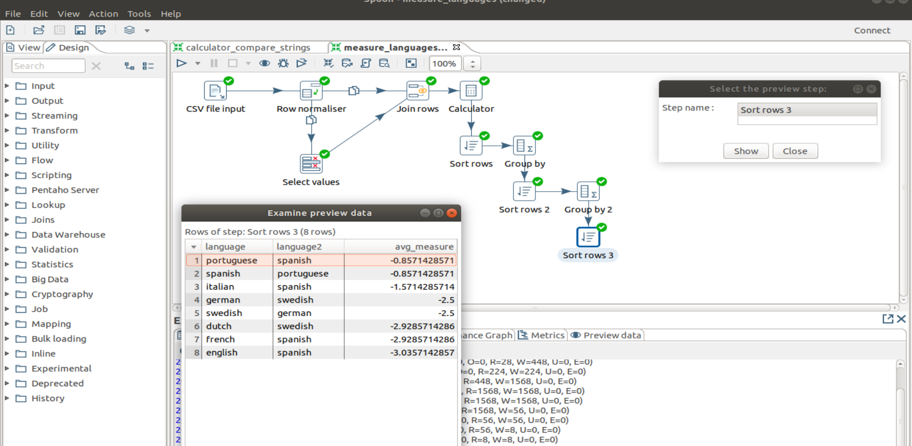
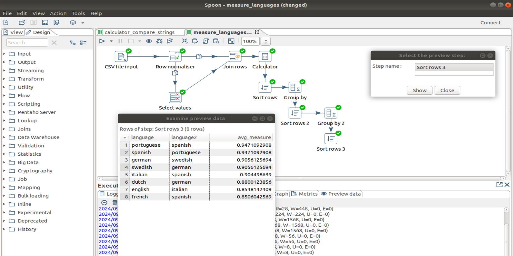

# Lab 4: String Similarity and Distance Metrics <!-- omit in toc -->

This lab focuses on string similarity and distance metrics, which are used to measure how "different" or "similar" two strings are. These metrics are widely used in applications like spell checking, plagiarism detection, natural language processing, and bioinformatics.

- [Calculations Explanations](#calculations-explanations)
  - [Levenshtein Distance aka Edit Distance](#levenshtein-distance-aka-edit-distance)
    - [Example Explanation:](#example-explanation)
    - [Additional Examples:](#additional-examples)
  - [Damerau-Levenshtein Distance](#damerau-levenshtein-distance)
    - [Example Explanation:](#example-explanation-1)
    - [Additional Examples:](#additional-examples-1)
  - [Needleman-Wunsch Distance](#needleman-wunsch-distance)
    - [Example Explanation:](#example-explanation-2)
    - [Additional Examples:](#additional-examples-2)
  - [Jaro Distance](#jaro-distance)
    - [Example Explanation:](#example-explanation-3)
    - [Additional Examples:](#additional-examples-3)
  - [Jaro-Winkler Distance](#jaro-winkler-distance)
    - [Example Explanation:](#example-explanation-4)
    - [Additional Examples:](#additional-examples-4)
- [Awnser to Questions](#awnser-to-questions)
  - [81](#81)
  - [82](#82)
  - [83](#83)
  - [84](#84)


## Calculations Explanations

### Levenshtein Distance aka Edit Distance

The **Levenshtein distance** measures the minimum number of single-character edits (insertions, deletions, or substitutions) required to change one string into another. This is a straightforward way to calculate the "edit distance" between two strings.

#### Example Explanation:

```
levenshtein("Austria", "Autriche") = 4
```



We can also compute the distance using a matrix:




#### Additional Examples:

```
levenshtein("Ireland", "Ierland") = 2
levenshtein("Dinamarca", "Danimarca") = 2
levenshtein("Chipre", "Cypern") = 4
levenshtein("Österreich", "Österrike") = 3
```

### Damerau-Levenshtein Distance

The **Damerau-Levenshtein distance** extends the Levenshtein distance by also allowing **transpositions** of adjacent characters. 
>In the Levenshtein distance this
would be 2 changes instead of 1

#### Example Explanation:

In the case of `"Austria"` and `"Autriche"`, this still involves 4 edits, because there are no adjacent characters to transpose.

```
damerau_levenshtein("Austria", "Autriche") = 4
```

However in the case of `"Ireland"` and `"Ierland"`, the transposition of `'r'` and `'e'` is considered a single edit.

```
damerau_levenshtein("Ireland", "Ierland") = 1
```

#### Additional Examples:

```
damerau_levenshtein("Dinamarca", "Danimarca") = 1
damerau_levenshtein("Chipre", "Cypern") = 4
damerau_levenshtein("Österreich", "Österrike") = 1
```

### Needleman-Wunsch Distance

The **Needleman-Wunsch distance** is similar to the Levenshtein distance but is used for aligning two strings with gaps (insertions or deletions). 

Match has zero or positive score, mismatch and gaps have negative score.

#### Example Explanation:

For the strings `"Austria"` and `"Autriche"`, aligning the strings with minimum gaps gives us a distance score of -4 (this depends on the specific scoring matrix used, such as penalties for mismatches and gaps).



```
needleman_wunsch("Austria", "Autriche") = -4
```

#### Additional Examples:

```
needleman_wunsch("Ireland", "Ierland") = -2
needleman_wunsch("Dinamarca", "Danimarca") = -2
needleman_wunsch("Chipre", "Cypern") = -4
needleman_wunsch("Österreich", "Österrike") = -3
```

### Jaro Distance

The **Jaro distance** is a measure of similarity between two strings. It considers the number of matching characters and the number of transpositions (characters that are out of order but still matching). The Jaro distance ranges between 0 and 1, where 1 means the strings are identical.

#### Example Explanation:

For `"Austria"` and `"Autriche"`, the similarity score is 0.7797619048. A higher score indicates more similarity.

```
jaro("Austria", "Autriche") = 0.7797619048
```

#### Additional Examples:

```
jaro("Ireland", "Ierland") = 0.9523809524
jaro("Dinamarca", "Danimarca") = 0.962962963
jaro("Chipre", "Cypern") = 0.6944444444
jaro("Österreich", "Österrike") = 0.8546296296
```

### Jaro-Winkler Distance

The **Jaro-Winkler distance** is a variant of the Jaro distance that gives more weight to similarities at the beginning of the strings. It is especially useful when strings have common prefixes.

#### Example Explanation:

For `"Austria"` and `"Autriche"`, the prefix `"A"` is identical, so the Jaro-Winkler score is higher than the Jaro score.

```
jaro_winkler("Austria", "Autriche") = 0.8238095238
```

#### Additional Examples:

```
jaro_winkler("Ireland", "Ierland") = 0.9571428571
jaro_winkler("Dinamarca", "Danimarca") = 0.9666666667
jaro_winkler("Chipre", "Cypern") = 0.6944444444
jaro_winkler("Österreich", "Österrike") = 0.9418518519
```

## Awnser to Questions

### 81

The results don't change when changing the transformation from Levenshtein to Damerau-Levenshtein.


### 82

The results change. I had to change the sorting order of `avg_measure` to not ascending in `Sort Rows 2` and `Sort Rows 3` to get the correct results.



### 83


### 84

