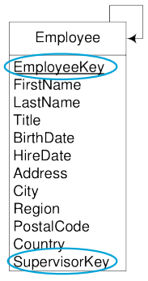

# Designing a Data Warehouse - Hierarchies <!-- omit in toc -->

> This file complements the [Designing a Data Warehouse](./data-warehouse-design.md) file.
> 

Table of Contents

- [Hierarchies](#hierarchies)
  - [Example of Hierarchies](#example-of-hierarchies)
- [Types of Hierarchies](#types-of-hierarchies)
  - [Balanced Hierarchy](#balanced-hierarchy)
    - [Example:](#example)
    - [How to encode a balanced hierarchy in a database:](#how-to-encode-a-balanced-hierarchy-in-a-database)
  - [Unbalanced Hierarchy](#unbalanced-hierarchy)
    - [Example:](#example-1)
    - [How to encode an unbalanced hierarchy in a database:](#how-to-encode-an-unbalanced-hierarchy-in-a-database)
  - [Recorsive Hierarchy](#recorsive-hierarchy)
    - [Example:](#example-2)
  - [Generalized Hierarchy](#generalized-hierarchy)
    - [Example:](#example-3)
    - [How to encode a generalized hierarchy in a database:](#how-to-encode-a-generalized-hierarchy-in-a-database)
  - [Ragged Hierarchy](#ragged-hierarchy)
    - [Example:](#example-4)
    - [How to encode a ragged hierarchy in a database:](#how-to-encode-a-ragged-hierarchy-in-a-database)
  - [Alternative Hierarchy](#alternative-hierarchy)
    - [Example:](#example-5)
    - [How to encode an alternative hierarchy in a database:](#how-to-encode-an-alternative-hierarchy-in-a-database)
  - [Non-strict Hierarchy](#non-strict-hierarchy)
    - [Example:](#example-6)
    - [How to encode a non-strict hierarchy in a database:](#how-to-encode-a-non-strict-hierarchy-in-a-database)
  - [All together](#all-together)

## Hierarchies

For each dimension, the values can be organized in different hierarchies.

### Example of Hierarchies

- Time Dimension:
  - Year > Semester > Quarter > Month > Day
- Location Dimension:
  - Continent > Country > State > City > Street
- Hour Dimension:
  - Shift > Hour > Minute

## Types of Hierarchies

### Balanced Hierarchy

- All levels are **mandatory**
- All branches have the **same depth**
- A child can have **only one parent**

#### Example:
- Year > Semester > Quarter > Month > Day

#### How to encode a balanced hierarchy in a database:
- Use a flat table or a snowflake schema.

---

### Unbalanced Hierarchy

- Some levels are **optional**
- Branches may have** different depths**
- A child can have **only one parent**

#### Example:
- Bank > Agency > ATM
  - Not all agencies have ATMs

#### How to encode an unbalanced hierarchy in a database:
- Transform the hierarchy into a **balanced hierarchy** using placeholders
- Use a flat table or a snowflake schema.

---

### Recorsive Hierarchy

- All levels are the same type
- Can easily become an unbalanced hierarchy
- Requires recursive queries to be navigated

#### Example:
- Manager > Employee
  - An employee can be a manager of another employee

---

### Generalized Hierarchy

- The same level can have different types of children

#### Example:
- Customers of a bank
  - Can be a person or a company

#### How to encode a generalized hierarchy in a database:
- Use a flat table with NULLs or a snowflake schema.

---

### Ragged Hierarchy

- One or more levels can be skipped

#### Example:
- Continent > Country > State > City
  - Some countries have no states

#### How to encode a ragged hierarchy in a database:
- Add extra foreign keys to allow the skipping of levels
- Or use placeholders to transform it into a balanced hierarchy

---

### Alternative Hierarchy

- The same level can have alternative aggregation paths

#### Example:
- Time can be the calendar year or the fiscal year
  - Calendar Year > Semester > Quarter > Month > Day
  - Fiscal Year > Semester > Quarter > Month > Day

#### How to encode an alternative hierarchy in a database:
- Use a snowflake schema.
- Basically the generalized hierarchy but withouth the NULLs

---

### Non-strict Hierarchy

- A child can have multiple parents

#### Example:
- Agency > Employee
  - An employee can work in multiple agencies

#### How to encode a non-strict hierarchy in a database:
- Queries must be carefully designed to avoid double counting

---

### All together

> TODO: check this because it has been created by Copilot

--- | Balanced | Unbalanced | Recursive | Generalized | Ragged | Alternative | Non-strict
--- | --- | --- | --- | --- | --- | --- | ---
**Levels** | All | Some | Same | Same | Some | Same | Same
**Depth** | Same | Different | Same | Same | Different | Same | Same
**Parent-Child** | One | One | One | One | One | One | Multiple
**Encoding** | Flat/Snowflake | Flat/Snowflake | Recursive | Flat/Snowflake | Flat/Snowflake | Snowflake | Careful Queries
