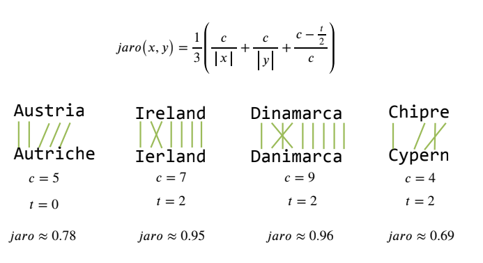
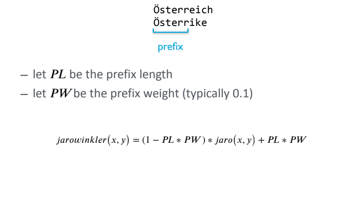
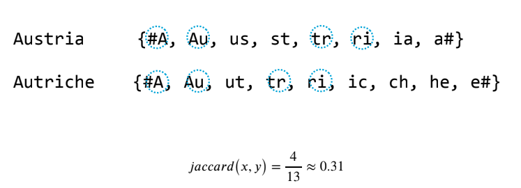
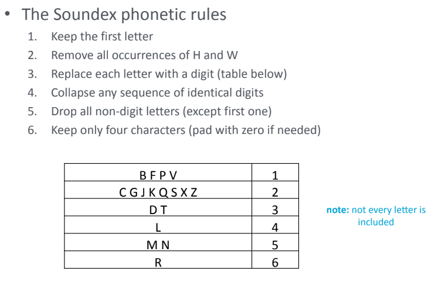
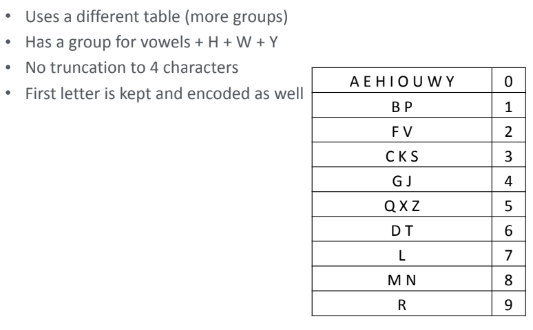

# String Matching <!-- omit in toc -->

Table of Contents

- [Why do we need string matching?](#why-do-we-need-string-matching)
- [Sequence Based Metrics](#sequence-based-metrics)
  - [Edit Distance (Levenshtein Distance)](#edit-distance-levenshtein-distance)
  - [Damerau-Levenshtein Distance](#damerau-levenshtein-distance)
  - [Needleman-Wunsch Measure](#needleman-wunsch-measure)
  - [Jaro Measure](#jaro-measure)
  - [Jaro-Winkler Measure](#jaro-winkler-measure)
- [Set Based Metrics](#set-based-metrics)
  - [Jacquard Similarity](#jacquard-similarity)
- [Phonetic Metrics](#phonetic-metrics)
  - [Soundex Measure](#soundex-measure)
  - [Refined Soundex](#refined-soundex)

## Why do we need string matching?

String matching can be usefull in schema matching via data matching.

- **Distance** between two strings:
  - Lower is better
  - Higher is worse
- **Similarity** between two strings:
  - Higher is better
  - Lower is worse

The measures can be:
1. [Sequence Based Metrics](#sequence-based-metrics)
2. [Set Based Metrics](#set-based-metrics)
3. [Phonetic Metrics](#phonetic-metrics)

## Sequence Based Metrics

View the strings as sequences of characters.

- Edit Distance (Levenshtein Distance)
- Damerau-Levenshtein Distance
- Needleman-Wunsch measure
- Jaro Measure
- Jaro-Winkler Measure

### Edit Distance (Levenshtein Distance)

> Distance so lower is better.

The **minimum** number of operations required to transform one string into another.
- If the characters are the same, do not change - the cost is 0
- If the characters are different, mismatch or use gap - the cost is 1

### Damerau-Levenshtein Distance

> Distance so lower is better.

Similar to the edit distance, but also allows for transpositions (in the levenshtein distance, the transposition is considered as two operations).

### Needleman-Wunsch Measure

> Similarity so higher is better.

Similar to the edit distance, but the cost of the operations is different.
- Match: 0 or positive score
- Mismatch: negative score

Its flexible so the value of the scores can be changed.

### Jaro Measure

> Similarity so higher is better.

### Jaro-Winkler Measure

> Similarity so higher is better.

A variant of the Jaro measure for string with common prefix.

## Set Based Metrics

View the strings as sets of characters.

### Jacquard Similarity

> Similarity so higher is better.

The ratio of the size of the intersection to the size of the union of the sets.

## Phonetic Metrics

Match strings based on their sound.

- Soundex
- Refined Soundex

### Soundex Measure

- It's turned into American English.
- Has many false positives.
- Has some false negatives.

### Refined Soundex

 

- Still for American English.
- Less false positives.
