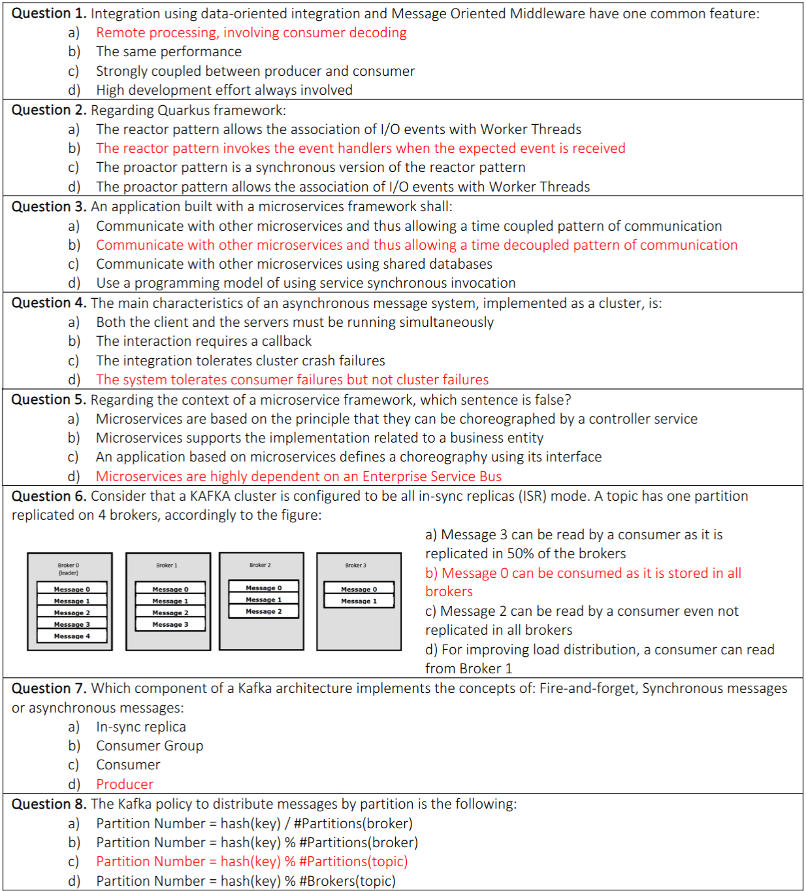
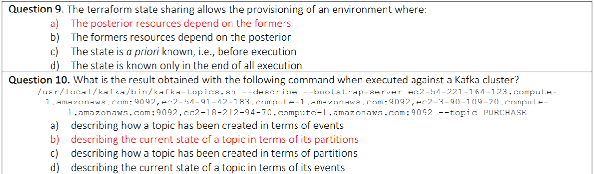
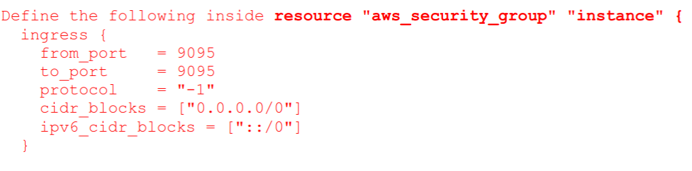
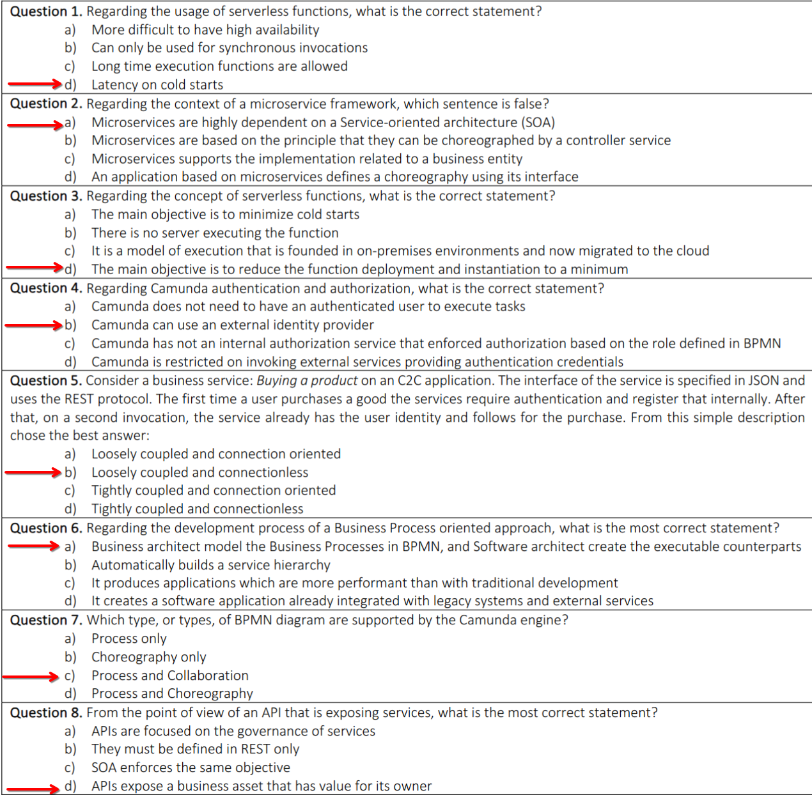
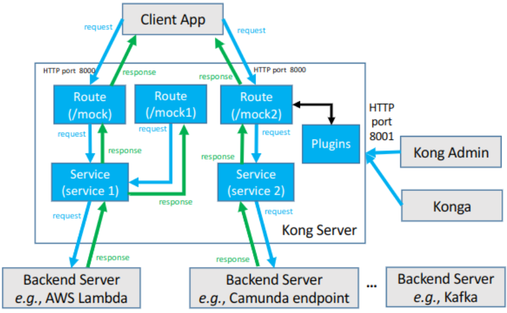
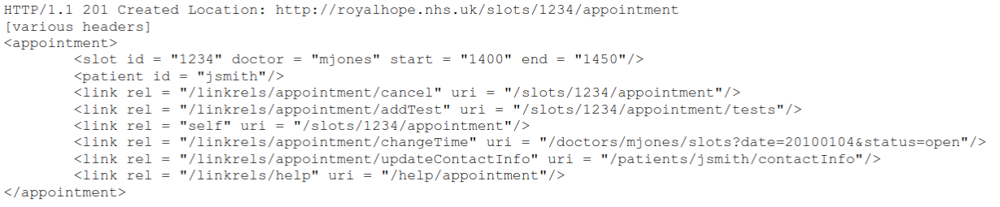
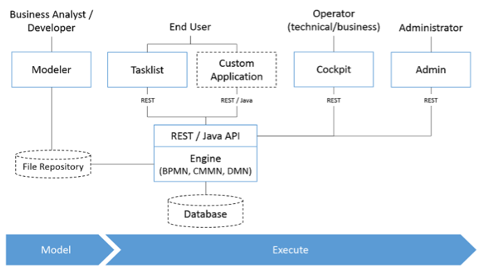
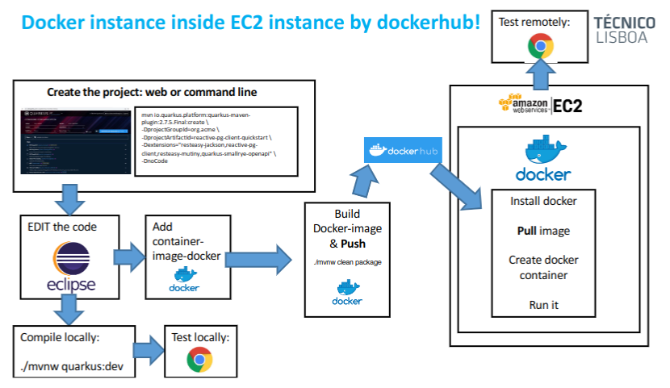

# MAP 1





---

**Explain what is the purpose of the mechanism of Kafka partition and how should the partitions be defined? Justify, in detail, your answer.**
Topics are broken down into partitions where each partition is a single log, with the purpose of distributing the storage and computation of a topic that cannot be divided.
There is no limitation of creating partitions by each broker. Partitions should be defined accordingly with the definition of available filesystem distribution, the available cpus and network restrictions.

**Is it possible to delete or update a message contained in a Kafka Commit log? Why or why not?**
No, it ́s not possible. Why? a commit log is designed to provide a durable record of all transactions so that they can be replayed to consistently build the state of a system.

**What is the mechanism of Quarkus Non-blocking database with pipelining, and explain in detail how does it work?**
It’s a mechanism that enables the shared connection for a database, requiring a for compatible database for that
purpose. The following figure explain the components required on I/O thread. In the opposite of blocking, or non-
blocking, database, the worker thread and I/O thread are released to further processing until the database finishes the computation and then call-back the I/O thread for end of computation on the Quarkus side.

**What is the Kafka Consumer group rebalancing mechanism, and in which conditions should it be executed?**
Consumers work as part of a consumer group, which is one or more consumers that work together to consume a topic.
The group ensures that each partition is only consumed by one member. Additionally, if a single consumer fails, the
remaining members of the group will reassign the partitions being consumed to take over for the missing member: Rebalance -> when it is required to execute.

---



---

---

```
The process starts when a technician receives a new prescription.
The process interest involves three participants: Technician, Pharmacist and Pharmacy System.
First, the technician enters the prescription details. Afterwards, the pharmacy system performs a drug utilization review. If an alarm is triggered, then the Pharmacist Perform a Thorough check. Otherwise, the pharmacy system checks the insurance coverage (3rd party company) to verify credit.
If drugs are covered by insurance, then the technician collect the drugs from shelves and the Pharmacist check its quality.
If drugs quality is OK the technician collects the payment and the process ends.
Otherwise, technician repeats the drugs collection from shelves and the Pharmacist check its quality again.
```

**From the textual description above, what are the microservices that you need to create to support this process model? (IMPORTANT – remember the definition of microservice)**

At least the following microservices – aligned with the business entities presented in the textual description:
**Technician - CRUD**; **Pharmacist - CRUD**; **Client - CRUD**; **Order – CRUD** – relates the client with drug; **Drug - CRUD**;**Insurance – CRUD** – relates with client; **Payment – CRUD** - relates with order;

# MAP 2



---

- **Cold Start**: The process of initialization of the serverless function, encompassing the extension initialization, the runtime initialization and the function initialization. Everything runs before the invocation of the function.
- **Warm Execution**: The warm execution corresponds to the invocation itself but requires that a previous cold start has been executed

---



- **Which are the components used to create services?** Kong Admin or Konga
- **If you have a new backend server what is the creation sequence in kong? Create the route, and then, the service or the opposite?** Service first, then route.
- **In this figure, what is the HTTP port used to invoke the Kafka backend server through Kong?** 8000
- **What is(are) the route(s) available to access service 2?** /mock2

---



**Explain in detail, what is the purpose of the provided link tags in the appointment?** This capability is provided in the maturity level 3 and the purpose is to contextualize and operate the following API Rest requests that can be used after using the API Rest appointment of the slot 1234. The provided requests corresponds to cancellation, other test, change in the appointment, a change in Time, a change in contact information and an endpoint for helping with the appointment.

---



Considering the CAMUNDA architecture depicted in the following side figure, identify the component (or the components) that is (or are) responsible:

- **To execute a decision table using the DMN notation?** Camunda Engine
- **To create a user to be involved in a business process instance?** Admin
- **To store the history of business process instances history?** Database
- **To assess the state of a business process instance?** Cockpit

---



How can you use the following four technologies, in the table below, to increase the number of deployed microservices while keeping the limited number of EC2 instances?

- **AWS Accounts**: Dividing EC2 instances by different AWS accounts
- **Docker Images**: Creating less EC2 instances and pulling multiple images to the same EC2 instance
- **RDS Databases**: The bootleneck reported is on EC2 and not RDS. One technology does not replace the other.
  No impact estimated.
- **Lambda Functions**: Migrating the source code of microservices to lambda functions, and thus, minimizing EC2
  instances

---

**Consider that multiple instances of a given business process are required to be executed concurrently, which is functionality supported by Camunda. Explain, in detail, how the Camunda mechanism can differentiate each instance of the given business process?**
This is possible by: Correlation ID of a process using Camunda business key (business key in the payload of each API request to start an instance of a business process).
Each instantiation provides a correlation ID that is kept while an instance executes.
Then, whenever any external activity interacts with the instance it needs to refer to a specific correlation ID
