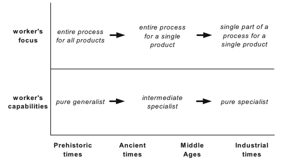

# Chapter 1: Introduction to Business Process Management <!-- omit in toc -->

Table of Contents

- [What is Business Process Management?](#what-is-business-process-management)
- [Examples of Business Processes](#examples-of-business-processes)
- [Ingredients of a Business Process](#ingredients-of-a-business-process)
  - [Core Elements](#core-elements)
  - [Outcomes](#outcomes)
  - [Supporting Components](#supporting-components)
- [Origins and History of Business Process Management](#origins-and-history-of-business-process-management)
- [The BPM Lifecycle](#the-bpm-lifecycle)

## What is Business Process Management?

BPM is the art and science of managing how work is performed in an organization to **ensure consistent outcomes** and to **take advantage of improvement opportunities**.

Some objectives of BPM are:
- Reduce errors and risks
- Reduce costs
- Increase efficiency

BPM focuses on managing business processes, which are a set of activities that are performed in a coordinated manner to achieve a specific outcome.

## Examples of Business Processes

> Lead: A potential customer who has shown interest in a product or service.  
> Quote: A document that specifies the price of a product or service.

- **Lead-to-quote**: The process of converting a lead into a quote for a product or service.
- **Quote-to-order**: The process of converting a quote into an order for a product or service.
- **Order-to-cash**: The process of converting an order into cash by delivering the product or service to the customer.
- **Procure-to-pay**: The process of purchasing goods or services from a supplier and paying for them.
- **Application-to-approval**: The process of submitting an application for approval and getting it approved.
- **Fault-to-resolution**: The process of identifying a fault in a product or service and resolving it.
- **Issue-to-resolution**: The process of identifying an issue in a product or service and resolving it.

## Ingredients of a Business Process

### Core Elements
The following 3 ingredients are essential for a business process:
- **Events**: Something that happens in the business process that can **trigger a sequence of activities**.
- **Activities**: Work that is performed as part of a business process.
  - **Task**: Represents a unit of work that is performed by a participant in the business process.
- **Decision Points**: Points in the business process where a decision is made on the next step in the process.

### Outcomes
After a business process is realized, it will deliver an **outcome**. This outcome may be:
- **Positive Outcome**: The business process was successful and gives value to the **customer**.
- **Negative Outcome**: The business process was unsuccessful.

### Supporting Components
Business Processes always involves:
- **Actors**: People or systems that perform activities in the business process.
  - **External Actors**: Actors that are outside the organization.
  - **Internal Actors**: Actors that are inside the organization (process participants).
- **Objects**: Data that is required or produced by activities in the business process.
  - **Physical Objects**: Tangible objects that are used in the business process (e.g. a equipment, materials, paper documents).
  - **Informational Objects**: Intangible objects that are used in the business process (e.g. electronic documents or records).

## Origins and History of Business Process Management

Over the ages, BPM has evolved from more general to more specific concepts.

## The BPM Lifecycle

The BPM lifecycle consists of the following phases:
1. **Process Identification**: Identify the business processes that need to be managed.
2. **Process Discovery**: Discover the activities, events, and decisions that are part of the business process.
3. **Process Analysis**: Analyze the business process to identify bottlenecks, inefficiencies, and improvement opportunities.
4. **Process Redesign**: Redesign the business process to improve its performance.
5. **Process Implementation**: Implement the redesigned business process.
6. **Process Monitoring**: Monitor the performance of the business process.
7. Return to **Process Discovery**.
