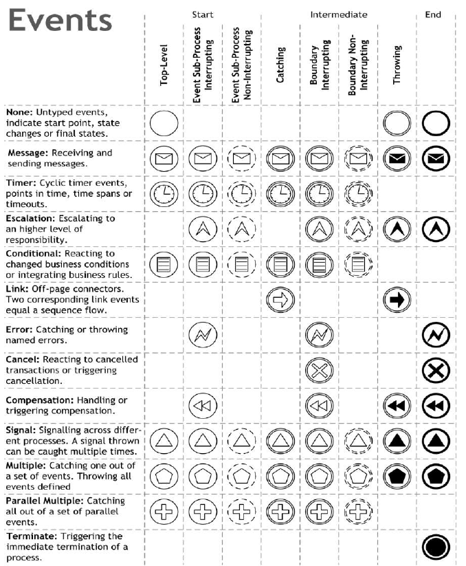

# Chapter 3: Essential Process Modeling

> TODO: its incomplete

## BPMN Core Elements

Element | Image | Description
------- | ----- | -----------
Activity |  | Represents work that is performed as part of a business process. There are different [types of activities](#activity-types)
Event |  | Represents something that happens in the business process that can trigger a sequence of activities. There are different types of events: start, intermediate, end.
Gateway |  | Represents a decision point in the business process that decides the next step in the process. Capture forking and joining paths in the process. There are different types of gateways: exclusive, inclusive, parallel, event-based, complex, etc.
Sequence Flow |  | Represents the order in which activities are performed in the business process. It is used to connect two flow objects in the process.
Message Flow |  | Represents the flow of messages between two participants in the business process. It is used to show the communication between participants in the process.
Business Objects |  | Represents the data that is required or produced by activities in the business process. It is used to show the data flow in the process.
Pool |  | Represents a participant in the business process. It is used to show the boundaries of the process and the participants involved in the process.
Lane |  | Represents a sub-partition of a pool. It is used to group activities that are performed by the same participant in the process.

### Activity Types

##### Activity Markers

Marker | Image | Description
------ | ----- | -----------
Sub-Process |  | Represents a group of activities that are performed as part of a business process. It is used to show a detailed view of a subprocess in the process.
Loop |  | Represents a loop in the business process that repeats a sequence of activities until a certain condition is met.
Parallel Multi-Instance |  | Represents a parallel multi-instance activity in the business process that executes multiple instances of the activity in parallel.
Sequential Multi-Instance |  | Represents a sequential multi-instance activity in the business process that executes multiple instances of the activity in sequence.
Ad-Hoc |  | Represents an ad-hoc activity in the business process that can be performed in any order or sequence.
Compensation |  | Represents a compensation activity in the business process that is performed when an error occurs in the process.

#### Task

TODO

##### Task Types

Type | Image | Description
---- | ----- | -----------
Send Task |  | Represents a task that sends a message to another participant in the process.
Receive Task |  | Represents a task that receives a message from another participant in the process.
User Task |  | Represents a task that is performed by a human user in the process.
Manual Task |  | Represents a task that is performed manually in the process.
Business Rule Task |  | Represents a task that executes a business rule in the process.
Service Task |  | Represents a task that invokes a service in the process.

#### Transaction

TODO

#### Event Sub-Process

TODO

#### Call Activity

TODO

### Gateway Types

#### Exclusive Gateway

When splitting, only one of the outgoing sequence flows can be taken. When joining, it waits for one incoming sequence flow to complete before continuing.

##### Event-Based Gateway

Is always followed by catching events or receive tasks. When splitting, it waits for one of the incoming sequence flows to complete before continuing. When joining, only one of the outgoing sequence flows can be taken.

#### Parallel Gateway

When splitting, all outgoing sequence flows are taken in parallel. When joining, it waits for all incoming sequence flows to complete before continuing.

#### Inclusive Gateway

When splitting, one or more of the outgoing sequence flows can be taken. When joining, it waits for all incoming sequence flows to complete before continuing.

#### Complex Gateway

Complex gateways are used when the process flow cannot be modeled using the other types of gateways. They are used to model complex decision logic in the process.

#### Exclusive Event-Based Gateway (instantiate)

Each occurrence of a subsequence event starts a new process instance.

#### Parallel Event-Based Gateway (instantiate)

The occurence of all subsequent events starts a new process instance.

### Event Types

