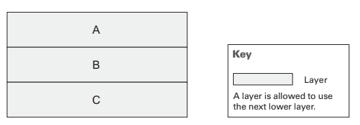
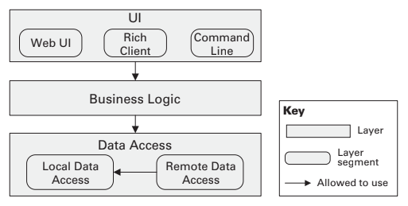
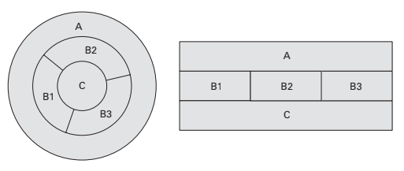
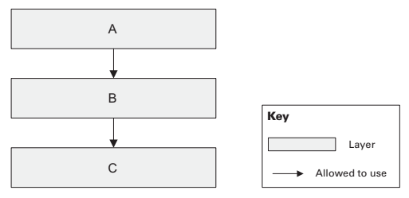
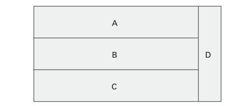

# Material Study: Uses and Layered Styles <!-- omit in toc -->

Table of Contents

- [Uses Style](#uses-style)
  - [Overview](#overview)
  - [Elements, Relations, and Properties](#elements-relations-and-properties)
  - [What the Uses Style is For](#what-the-uses-style-is-for)
  - [Notations](#notations)
  - [Relation to Other Styles](#relation-to-other-styles)
- [Layered Style](#layered-style)
  - [Overview](#overview-1)
  - [Elements, Relations, and Properties](#elements-relations-and-properties-1)
  - [What the Layered Style is For](#what-the-layered-style-is-for)
  - [Notations](#notations-1)
  - [Relation to Other Styles](#relation-to-other-styles-1)

 

This class will talk about module styles.  
In [class 11](11_notes.md) we talked about [Decomposition](11_summary.md#decomposition-style) and [Data Model](11_summary.md#data-model-style) styles.  
In this class we will focus on [Uses](#uses-style) and [Layered](#layered-style) styles.  
In [class 13](./13_summary.md) we will talk about [Generalization](./13_summary.md#generalization-style) styles.

There are 6 importante module styles:
1. [Decomposition](./11_summary.md#decomposition-styles)
2. [Uses](#uses-style)
3. [Generalization](./13_summary.md#generalization-style)
4. [Layered](#layered-style)
5. [Aspects](./13_summary.md#aspect-style)
6. [Data Model](./11_summary.md#data-model-style)

## Uses Style

### Overview

This style focuses on the **uses** relation between elements (an specialized of *depends-on*). It is used to define the dependencies between modules. The main goal is to reduce complexity and increase modifiability.

### Elements, Relations, and Properties

TODO

### What the Uses Style is For

This style is useful for planning incremental development, for example, when a system is being developed by multiple teams. It is also useful for understanding the impact of changes in a module.

### Notations

- Informal Notation
  - Two columns table with the module name and the modules it uses.
  - Informar graphical notations
- Semi-formal Notation
  - UML class diagrams with dependencies between classes
  - Dependency Structure Matrix (DSM)

### Relation to Other Styles

This style is related with the [Layered Style](#layered-style) because it uses the *allowed-to-use* relation between layers.

Its also related with the [Decomposition Style](11_summary.md#decomposition-style) because it uses the *is-part-of* relation between elements.

## Layered Style

### Overview

This style represents the division of a system into layers. Each layer represents a grouping of modules that provide a set of services.

There are a *allowed-to-use* relation between layers. This relation must be unidirectional, from the lower layer to the higher layer. _A layer can use the services of the layer below it, but not the other way around._

### Elements, Relations, and Properties

TODO

### What the Layered Style is For

TODO

### Notations

- Informal Notation
  - **Stack** of rectangles, each one representing a layer.
    - 
  - Segmented Layers
    - 
  - Rings
    - 
  - Layers with arrows
    - 
  - Layers with sidecar
    - 
  - Size and color
- UML

### Relation to Other Styles

TODO