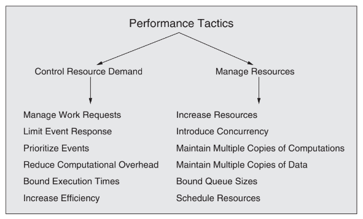

# Material Summary: Performance <!-- omit in toc -->

Table of Contents

- [Concurrency](#concurrency)
- [Performance General Scenario](#performance-general-scenario)
- [Tactics for Performance](#tactics-for-performance)
  - [Control Resource Demand](#control-resource-demand)
  - [Manage resources](#manage-resources)

## Concurrency

Concurrency is the ability to execute multiple tasks simultaneously (operations ocuurring in parallel).

Allowing concorrency operations can improve the performance of a system by reducing the time it takes to complete a task. One example is when a thread is waiting for a resource, the processor can switch to another thread and continue processing.

However, concurrency must be managed carefully because of the **interleaving phenomenon**. This is when two or more threads are accessing the same resource and the final result depends on the order of execution.
To deal with race conditions, we can use **synchronization** mechanisms such as:
- **Locks**: Prevents other threads from accessing a resource while it is being used.
- **Partition the state based on the thread**: Each thread has its own state and does not share it with other threads.
- **Have multiple copies of the state**: Each thread has its own copy of the state and does not share it with other threads.

## Performance General Scenario

Portion of Scenario | Description | Possible Values
------------------- | ----------- | ---------------
TODO

## Tactics for Performance

Performace tactics control the time or resources used to perform a task.

Main contributors to performance are:
- **Processing time and resource usage**: TODO
- **Blocked time and resource contention**: TODO
  - **Contection for resources**: TODO
  - **Availability of resources**: TODO
  - **Dependency on other computation**: TODO

### Control Resource Demand

- **Manage work requests**: TODO
  - **Manage event arrival**: TODO
  - **Manage sampling rate**: TODO
- **Limit event response**: TODO
- **Prioritize events**: TODO
- **Reduce computation overhead**: TODO
  - **Reduce redirection**: TODO
  - **Co-locate communication resources**: TODO
    - **Periodic cleaning**: TODO
- **Bound executation times**: TODO
- **Increase efficiency of resource usage**: TODO

### Manage resources

- **Increase resources**: TODO
- **Introduce concurrency**: TODO
- **Mantain multiple copies of computations**: TODO
- **Maintain multiple copies of data**: TODO
- **Bound queue sizes**: TODO
- **Schedule resources**: TODO