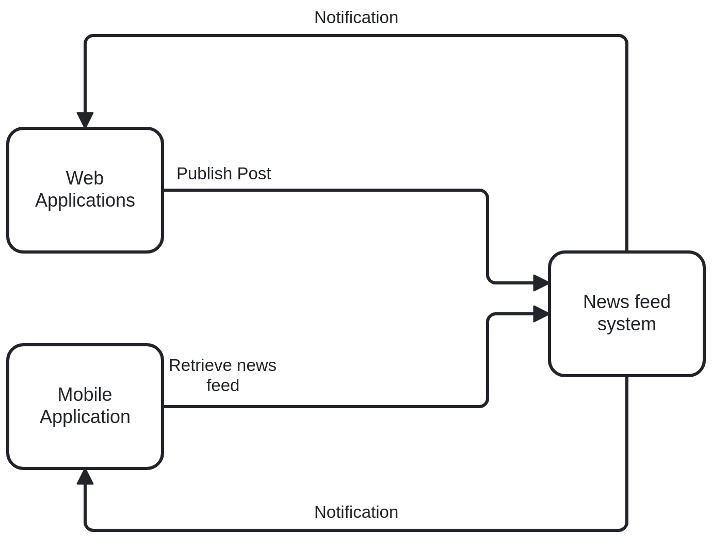

# Notes Problems Class 7 <!-- omit in toc -->

Table of Contents

- [1. Design context](#1-design-context)
- [2. Define functionalities](#2-define-functionalities)
  - [1. Publish Post:](#1-publish-post)
  - [2. Retrieve news feed:](#2-retrieve-news-feed)
- [3. Define Qualities](#3-define-qualities)
  - [Availability](#availability)
  - [Security](#security)
  - [Performance](#performance)
  - [Other qualities...](#other-qualities)
- [Rounds](#rounds)
  - [Round 1](#round-1)
    - [Iteration 1](#iteration-1)
    - [Iteration 2](#iteration-2)
  - [Round 2](#round-2)
    - [Iteration 1](#iteration-1-1)

 

Type of events:
- Periodic
- Sporadic
- ...

## 1. Design context

## 2. Define functionalities

### 1. Publish Post:
- Actors: Authenticated User
- Input: Post containing text
- Output: Post is persistentlly stored and eventually all friends are notified

### 2. Retrieve news feed:
- Actors: Authenticated User
- Output: Most recent post published by friends in reverse cronological order

## 3. Define Qualities

### Availability
- Stimulus: News feed system fails
- Artifact: News feed system
- Environment: Normal operation
- Response: continues to provide service
- Response Measure: 99.99% availability

### Security
- Source of threat: Authenticated user or non-authenticated user
- Attack: Submit large number of posts in a short period of time
- Environment: Normal operation
- Artifact: News feed system
- Response: Continues to provide service of non-attacking users
- Response Measure: 100% availability

---

- Source of threat: Authenticated user or non-authenticated user
- Stimulus: Submit post impersonating someone else
- Environment: Normal operation
- Artifact: News feed system
- Response: Cannot submit notify operation
- Response Measure: No integrity compromised

### Performance
- Source of stimulus: Authenticated users
- Stimulus: Retrieve news feed periodically 10.000/second
- Environment: Normal operation
- Artifact: News feed system
- Response: News feeds are correctly retrieved
- Measure: TP = 10.000/s, latency = ~500ms

---

- ...stocastic distribution
- Environment: Peak load
- ...
- Measure: TP = 20.000/s, latency = ~1s

---

- ...
- Stimulus: publish post
- ...
- Measure: latency = ~3-4 seconds

### Other qualities...

## Rounds

### Round 1

- Purpose: Fully Functional System and Supports authentication
- Architectural significant requirements: 
  - Functionality1, Functionality2 
  - Security1, Security2 (authentication)
  - C1 (web and mobile clients)

#### Iteration 1

- Goal: support functionalities
- TODO: include images of the architecture

#### Iteration 2

- Goal: support authentication
- TODO: include images of the architecture

### Round 2

- Purpose: Support Performance during normal operation
- Architectural significant requirements: 
  - Performance1, Performance2

#### Iteration 1

- Goal: support retrieval performance
  - We choose this one because have strong requirements